## o.lab2

* We want to enable you to design & implement complex systems;
* Complex systems are, for the lack of a better word, *complex* - so we need to figure out a way of thinking about things we're making to ensure that:
	* we understand the *steps* needed to carry out a task
	* our patches are *readable* and *easy to edit*
	* our work is *modular* and *scalable* (that is, it consists of pieces we understand well and can reuse in other patches, and that things can grow organically)
* For example, if we look at the requirements of Lab 2, what would be the best way of approaching it?


### What we have:

* buffer~ holds an audio file;
* play~ can play that audio file (either by using the "start <start time> <end time> <playback duration>" message or by a line~ that goes from <start time> to <end time> over the course of <playback duration> in milliseconds):

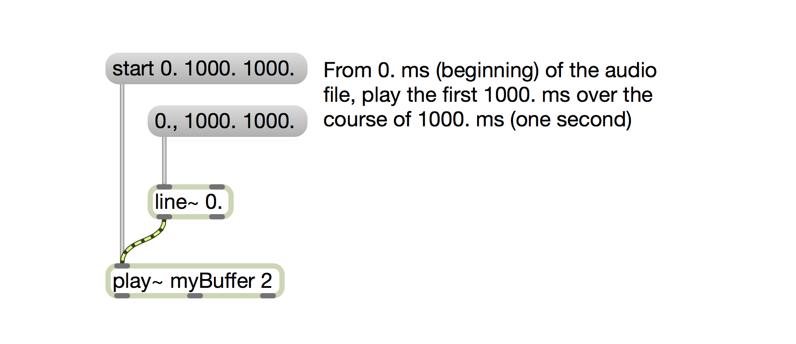

* waveform~ object provides us with a graphic interface to make selections, and outputs the <start time> and <end time> from its outlets:

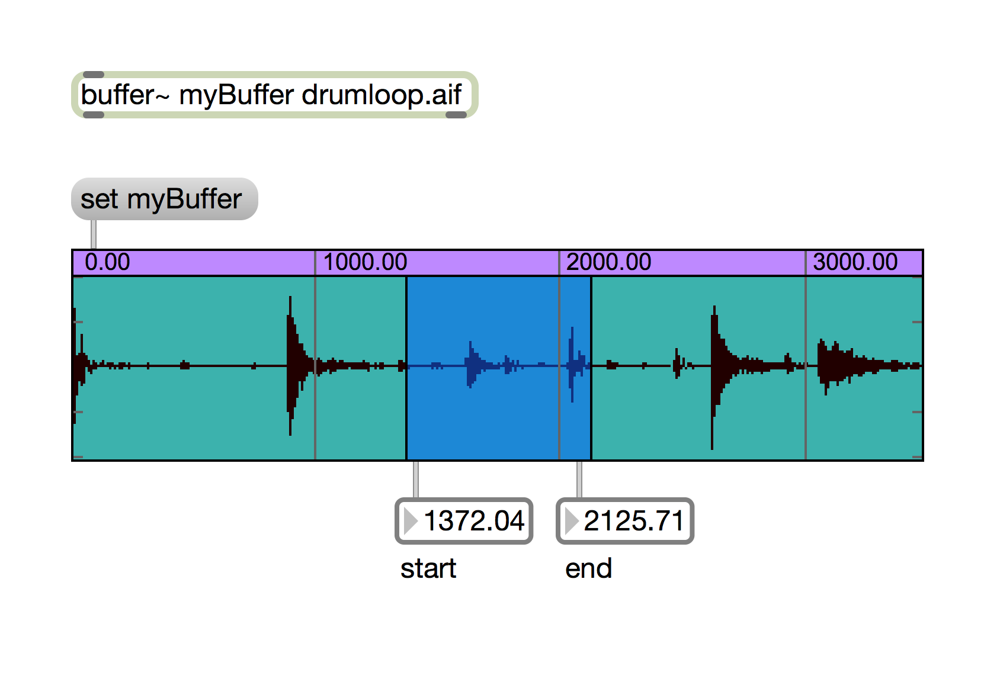

* an **o.message** object consists of
	* human-readable addresses (descriptive names) for data
	* actual numbers that we can use to drive Max objects

We'll work backwards. We need to give data for play~ to play back sound. What data do we need?

1. the buffer~ name (a symbol)
2. the start time (in milliseconds - a floating-point number)
3. the end time (in milliseconds - a floating-point number)
4. the duration (in milliseconds - a floating point number)

Let's write these in a **o.message**:

````
/buffer myBuffer
/start 0.
/end 1000.
/duration 1000.
````

To get some practical use out of this message, we need to learn how to create **o.messages** and how to access or *route* the data from the messages into our system.

### Accessing the data from **o.message**

If we have a message with all of these things, we may access the data by using its addresses. Routing data out of different outlets is the job of the **o.route** object. To make it work, we need to specify the addresses within the **o.route** object:

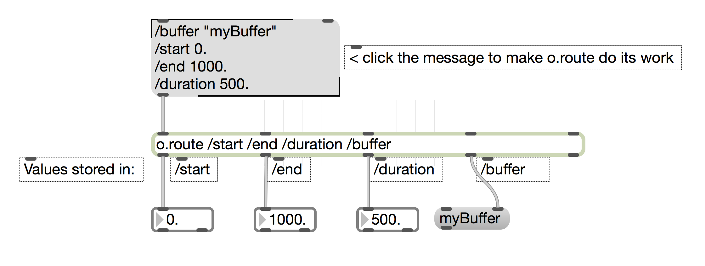

To use these values in our play~ object, we would need to deal with this data appropriately:

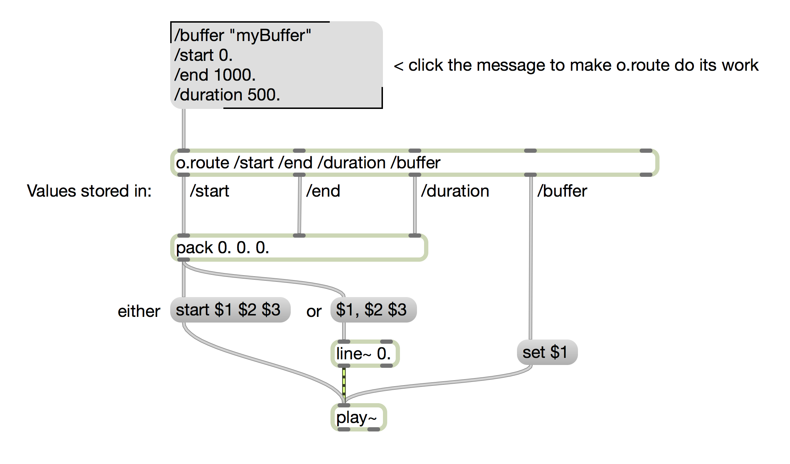

We may improve this later, but for now let's focus on creating meaningful messages that would contain these elements (`/buffer`, `/start`, `/stop`, and `/duration`) for play~ to use.

### What are we missing?

Although our waveform~ object provides us with the selection start & selection end, those aren't *necessarily* going to be the values for our `/start` and `/end` - if we wish to play through the selection backwards, `/start` needs to contain the selected end value, and `/end` needs to contain the selected start value. Furthermore, we might want to change duration value.

This would imply that we would need to store the values of our selection in different variables. We'll use `/selectionStart` and `/selectionEnd`. There are several ways of doing this, and we will start with the most obvious:

Let's create a different **o.message** that will take the values from waveform~ object:

````
/selectionStart $1
/selectionEnd $1
````
If this message receives a list of values from our waveform~ object, we have exactly what we need:

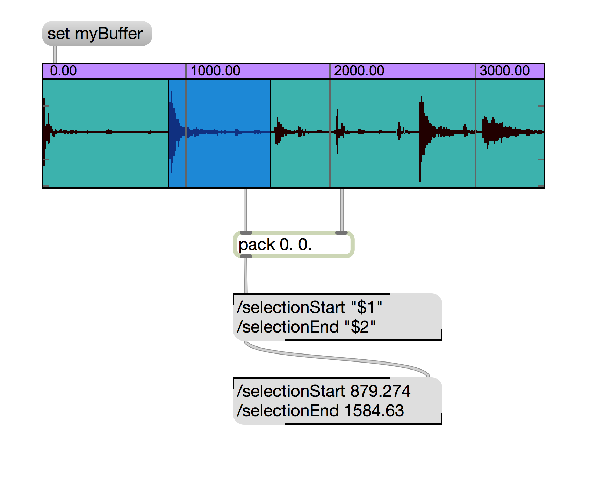

While the example above is visually clear, it's far from everything we need. After all, we also need to make sure that we are storing:

* the buffer name that we're operating on;
* the rate of playback - the number that we would multiply our direction by.

Let's start by simplifying the way we store things above first. Before the **o.message** receives the start and stop values, they are packed into a list using the pack object. We can use the **o.pack** to do the same thing for us:

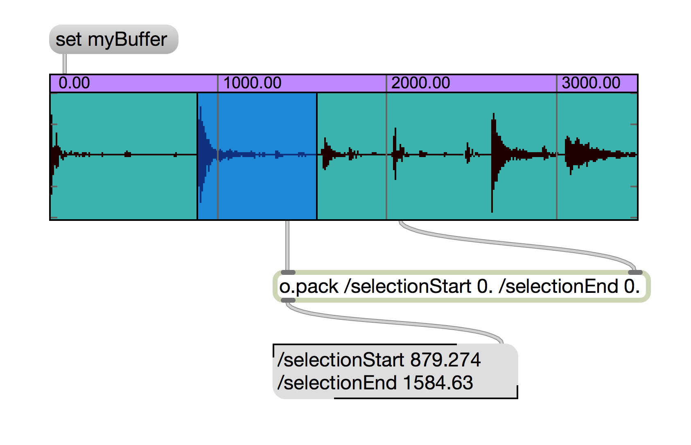

As you can see, the $-substitution is no longer necessary, as the **o.pack** requires us to specify the *addresses* or *variables* that we will storing our numbers in. From above, we also need rate and the buffer name, so let's add them to our **o.pack**:

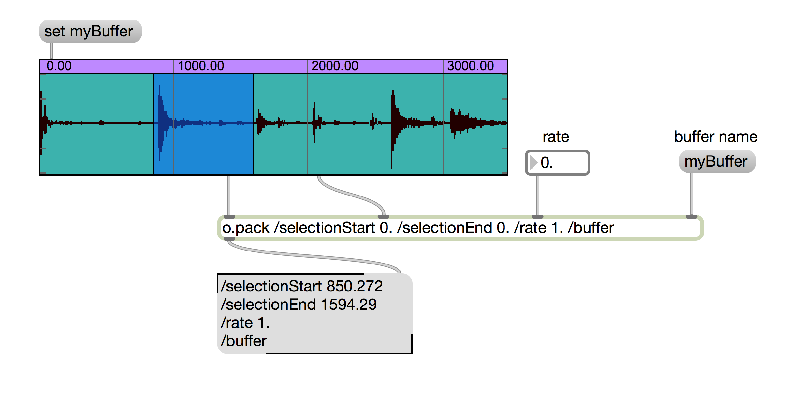

Before we improve this, let's break down what is happening:

* the "myBuffer" message is sent to **o.pack** - specifically to the inlet that sets the variable of `/buffer`
* the floating-point box is sent to **o.pack** - to the inlet that sets the variable of `/rate`
* the start & end values of the selection from waveform~ are sent to **o.pack** as above.

However, these values only update after we make our selection (since **o.pack** only has one hot inlet). To make sure that all of our changes are updated immediately, we will use **o.pak** - which works just like **o.pack**, but with all inlets hot.

The second issue is that in the above patch, we need to manually type in the name of the buffer~ at least twice: once to set the waveform~ display, and yet again to set our message. To fix this, we'll use the $-substitution to set the waveform~ and a trigger to make sure that the name of our buffer also goes to the correct inlet of our **o.pak**:

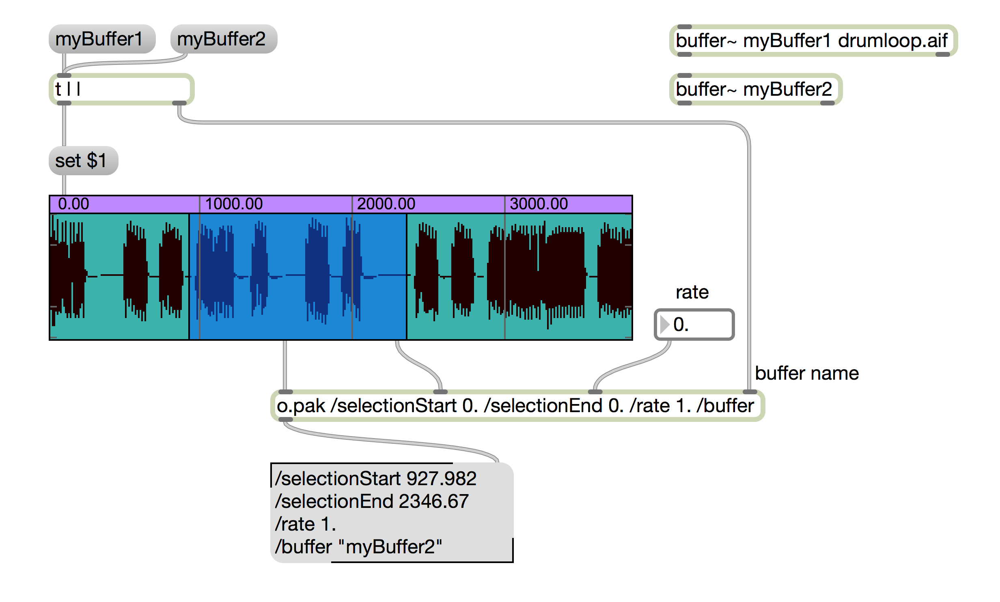

Provided you understand all of the steps above, let's continue onward to see why storing things in an **o.message** enables some magic.

*******

<br />
<br />

### Computing things we need:

To operate on the numbers stored in odot messages, we will use the **o.expr** object. Here's what you need to know:

1. **o.expr** can store and evaluate *expressions*
2. an *expression* can access values defined in the **o.message** that is passed to **o.expr**'s inlet
3. **o.expr** can define its own variables (or addresses) inside of the expression, and their values will be appended to the full message.

#### Simple Example:

Old McDonald had a farm, and he has some animals there. The following **o.message** keeps track of the animals he has:

````
/chickens 8
/cows 4
/pigs 7
/ostriches 12
/rabbits 9
````
(It's a small farm, times are kinda tough these days.) Let's see how we can use **o.expr** to compute the number of birds and the number of mammals on the farm. There are two types of birds on his farm - chickens and ostriches, so we need to add the two and to call that sum something that odot can understand, like … `/numberOfBirds` or something (feel free to use whatever you want):

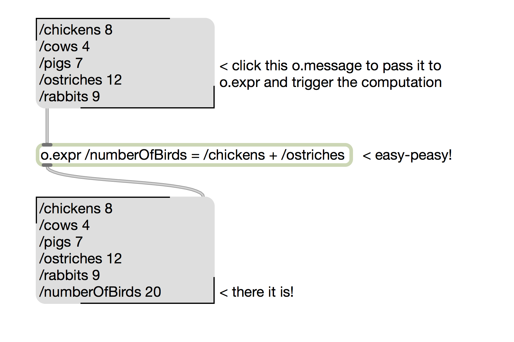

Now, we also would want to compute the number of mammals on the farm as well, and while the operation is the same as the one for birds, it is important to note that we can string multiple **o.expr** objects together and they will pass messages without a problem:

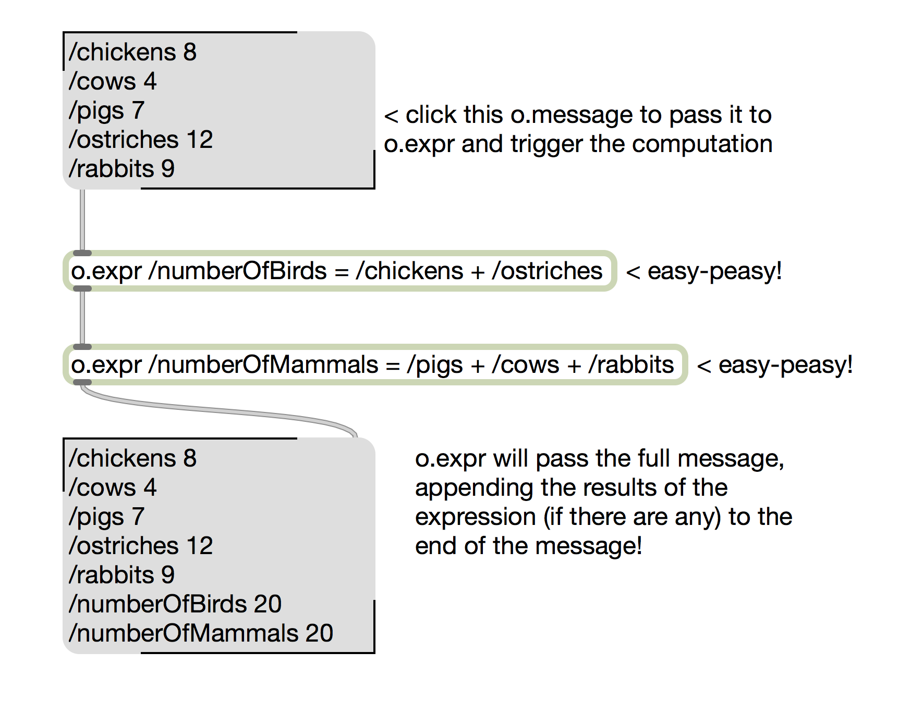

The reason why this stringing things together works is because **o.expr** passes the full message through it. In both of the cases above, we created new variables (`/numberOfBirds` and `/numberOfMammals`) but we may also operate directly on the contents of the existing variables. For example, since rabbits are well-known for their reproductive prowess, perhaps their number will have increased by the time we were done counting up the birds. Let's increment the number of rabbits in an **o.expr**:


Feel free to improve this - maybe rabbits multiply by some factor of their population? Maybe some of those rabbits die or get eaten by Old MCDonald? If you understand the expressions, let's return to dealing with digital audio and use **o.expr** to compute things we need.

#### TASK 1: Compute the duration of our selection:

From the lab, we know that we need to subtract `/selectionStart` from `/selectionEnd` - but we also need to find a descriptive name to store this. Since our final duration will still be scaled, let's call this direction `/selectionDuration` for clarity:

````
/selectionDuration = /selectionEnd - /selectionStart
````

Write this expression in an **o.expr** object and we are done with Task 1.

#### TASK 2: Compute the actual playback duration that will be seen by our play~ object:

We have already created a variable named `/rate` to scale the duration of our playback. The **o.expr** needed for this is easy-peasy:

````
/duration = /selectionDuration * /rate
````

But wait a second - this `/rate` variable makes it very difficult for us to deal with time, and it would be *much* nicer if we didn't have to remember that `0.5` means "half the time" and "twice as fast." Let's say that we would want the rate of `2.0` to mean "twice as fast" because that's much easier for us to remember. This would mean that instead of multiplying by `/rate` we need to multiply by `1 / rate` (or `1. / /rate` in the odot-speak):

````
/duration = /selectionDuration * ( 1. / /rate )
````

This is better, but not quite - we also would like to deal with the direction of our sample playback. In class we agreed that making `/rate` negative is a rather good way to communicate that we want the sample to play backwards. However, if `/rate` gets to be negative, we can not use it in our `/duration` computation (since the product is guaranteed to be negative and negative durations seem to make little sense). We need to use the *absolute value* of `/rate` - which we should all remember from our middle and high school math days. Luckily for us, **o.expr** provides a remarkable number of helper functions, and the one we will need is `abs()` - to get the absolute value.

````
/duration = /selectionDuration * ( 1. / abs( /rate ) )
````

The `abs()` function will return the absolute value of whatever goes inside the parentheses - and we need it to return the absolute value of our `/rate` variable. We will cover more functions as the semester goes on, but those eager to get a head start should consult the **o.expr** documentation.

#### TASK 3: Starting and Stopping the right endpoints:

Some tasks ask more than one question and require multiple steps. This is okay, since our o.farm example above showed us that multiple expressions are no big deal. Let's talk through what we need.

We have our `/selectionStart` and `/selectionEnd` variables. We know that they will coincide with our `/start` and `/end` variables if we're playing the sample forward. If we're playing it backward, we need to flip them (that is, `/end` is now `/selectionStart` and `/start` is now `/selectionEnd`). The logic is simple:

* if `/direction is 'forward'` 
	* `/start = /selectionStart`
	* `/end = /selectionEnd`
* else (otherwise)
	* `/start = /selectionEnd`
	* `/end = /selectionStart`
	
First problem: we don't have the value for `/direction` yet. To determine `/direction` our logic is similar:

* if `/rate is positive`
	* `/direction is forward`
* else (otherwise)
	* `/direction is backward`
	
How would we do this in **o.expr**? The syntax for **o.expr** that allows you to do the above logic is:

````
/direction = ( /rate > 0 ) ? forward : backward
````

The use of the `?` and the `:` symbols is not accidental. Let's compare the logic of the example to the syntax of the **o.expr** to make sure we have no misunderstandings.

1. we are assigning a value to `/direction` - we start with `/direction = `
2. we need to check if `rate is positive` written in **o.expr** as `( /rate > 0 )`
3. we include a question mark to communicate both to **o.expr** and to ourselves that the values that follow depend on this condition
4. we write down the value that we wish to assign if the check is true (that is, if `/rate > 0`): `forward`
5. we put a colon to separate that value from the other value that will be assigned if the check is false (that is, if `rate` is NOT `> 0`)
6. we write down the value that we wish to assign if the check is false: `backward`

When is this useful? When we want to assign different values based on the contents of other values. For example:

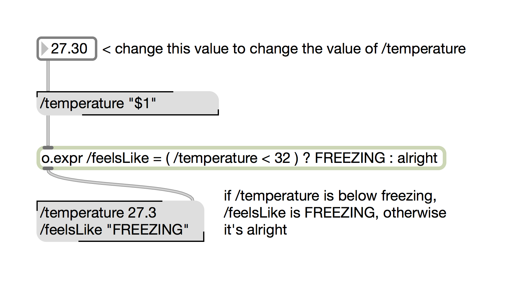

And also:

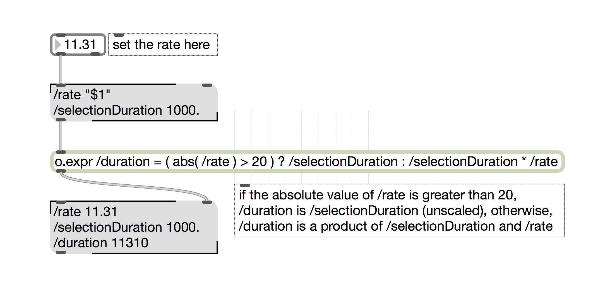

And finally, we use the very same trick to set our `/start` and `/end` variables - and I won't bother explaining them - make sure to type this up and experiment with different values and things to understand what's going on!

````
/start = ( /direction == forward ) ? /selectionStart : /selectionEnd
/end = ( /direction == forward ) ? /selectionEnd : /selectionStart
````

The only thing that may appear strange is the use of `==` symbol. Computers associate the `=` symbol with "assignment" - so that when **o.expr** sees `/start = 0.5` it will assign `0.5` to the variable `/start`. When we need to compare whether or not things are equal (which is what we're asking in our parentheses followed by a question mark above) we need a different symbol than the assignment. That symbol is `==` and `/start == 0.5` does not store `0.5` in `/start`. Instead, it checks to see if the contents of `/start` are actually 0.5 or not, and returns `true` if they are and `false` if they aren't. This should be enough to make you understand the **o.expr** expressions above.

### MORE TO COME:

* adding default values to everything
* storing & using lists in o.messages
* cordless patching
* abstractions